<a name="readme-top"></a>

<div align="center">
  
  <p>
  GitHub Homepage template built with Next.js, TypeScript and TailwindCSS.
  </p>

<!-- Badges -->
<p>
  <a href="https://github.com/ladunjexa">
    
  </a>
  <a href="https://github.com/ladunjexa/GitHub-Webpage/blob/master/LICENSE">
    
  </a>
  <a href="https://github.com/ladunjexa/GitHub-Webpage/graphs/contributors">
    
  </a>
  <a href="">
    
  </a>
  <a href="https://github.com/ladunjexa/GitHub-Webpage/network/members">
    
  </a>
  <a href="https://github.com/ladunjexa/GitHub-Webpage/stargazers">
    
  </a>
  <a href="https://github.com/ladunjexa/GitHub-Webpage/issues/">
    
  </a>
  <a href="https://github.com/ladunjexa/GitHub-Webpage/issues/">
    
  </a>
</p>

 <h4>
    <a href="https://github-site.vercel.app/">View Demo</a>
  <span> · </span>
    <a href="https://github.com/ladunjexa/GitHub-Webpage">Documentation</a>
  <span> · </span>
    <a href="https://github.com/ladunjexa/GitHub-Webpage/issues/">Report Bug</a>
  <span> · </span>
    <a href="https://github.com/ladunjexa/GitHub-Webpage/issues/">Request Feature</a>
  </h4>
</div>

<br />

<!-- Table of Contents -->
<details>

<summary>

# :notebook_with_decorative_cover: Table of Contents

</summary>

- [About the Project](#star2-about-the-project)
  - [Folder Structure](#bangbang-folder-structure)
  - [Tech Stack](#space_invader-tech-stack)
- [Getting Started](#toolbox-getting-started)
  - [Installation](#gear-installation)
  - [Run Locally](#running-run-locally)
- [Screenshots](#camera-screenshots)
- [Contributing](#wave-contributing)
- [License](#warning-license)
- [Contact](#handshake-contact)
- [Acknowledgements](#gem-acknowledgements)

</details>

<!-- About the Project -->

## :star2: About the Project

<div align="center"> 
  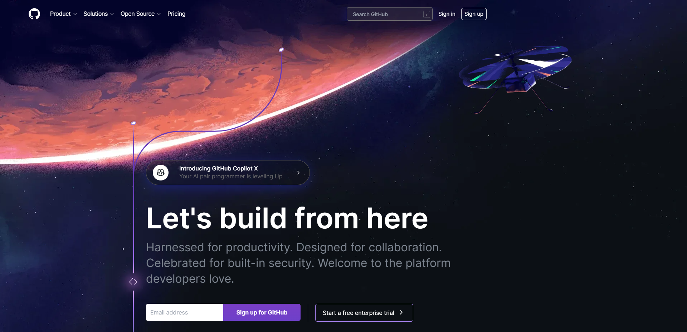
</div>
<br />

Next.js has the potential to revolutionize the industry and forever change the way we develop web applications. You’re still early in catching the trend and building your own Next.js 13 applications with TypeScript that leverage features such as server-side rendering and the app router.

This repository houses an amazing Frontend Next.js 13 Application which simulates the homepage of ***GitHub*** using Next.js, TypeScript, and TailwindCSS, combining powerful tools to deliver a responsive and user-friendly experience.

<!-- Folder Structure -->

### :bangbang: Folder Structure

Here is the code folder structure.
```
src/
├── @types/
│   └── index.ts
├── app/
│   ├── favicon.ico
│   ├── globals.css
│   ├── layout.tsx
│   └── page.tsx
├── assets/
│   └── icons/
|       └── ...
├── components/
│   ├── atoms/
│   │   ├── AnimatedAnchor.tsx
│   │   ├── AnimatedUnderline.tsx
│   │   ├── AtomsSec.tsx
│   │   ├── BranchPicture.tsx
│   │   ├── CopilotBlock.tsx
│   │   ├── HTMLBlock.tsx
│   │   ├── Picture.tsx
│   │   └── index.ts
│   ├── layout/
│   │   ├── navbar/
|   |   |   ├── options/
|   |   |   |   ├── OpenSource.tsx
|   |   |   |   ├── Product.tsx
|   |   |   |   └── Solutions.tsx
|   |   |   ├── utils/
|   |   |   |   ├── NavListItem.tsx
|   |   |   |   └── StickyNavbar.ts
|   |   |   └── index.tsx
│   │   ├── footer/
|   |   |   └── index.tsx
|   |   └── index.ts
│   ├── sections/
│   │   ├── Hero.tsx
│   │   ├── Productivity.tsx
│   │   ├── Collaboration.tsx
│   │   ├── Security.tsx
│   │   └── index.ts
│   └── widgets/
│       ├── BranchProd.tsx
│       ├── BranchCollab.tsx
│       ├── BranchSec.tsx
│       ├── CollabDialog.tsx
│       ├── Copilot.tsx
│       ├── Earth.tsx
│       ├── Globe.tsx
│       ├── IDE.tsx
│       ├── InteractiveCard.tsx
│       └── index.ts
├── data/
|   └── index.js
├── lib/
|   ├── hooks/
|   |   ├── useFloat.tsx
|   |   └── useNav.tsx
|   ├── GenerateContainer.tsx
│   └── index.ts
├── .eslintrc.json
├── .gitignore
├── next-env.d.ts
├── next.config.js
├── package.json
├── postcss.config.js
├── tailwind.config.js
└── tsconfig.json
```

<!-- TechStack -->

### :space_invader: Tech Stack

[](https://skillicons.dev)

<p align="right">(<a href="#readme-top">back to top</a>)</p>

<!-- Getting Started -->

## :toolbox: Getting Started

### :gear: Installation

#### Step 1:
Download or clone this repo by using the command below:

```bash
 https://github.com/ladunjexa/GitHub-Webpage.git
```

#### Step 2:

This webapp using NPM (Node Package Manager), therefore, make sure that Node.js is installed by execute the following command in console:

```bash
  node -v
```

#### Step 3:

In root folder execute the following command to get the required packages:

```bash
  npm install
```

<!-- Run Locally -->
### :running: Run Locally

#### Step 1:

Go to root folder and execute the following command in order to run the webapp:

```bash
  npm run dev
```

<p align="right">(<a href="#readme-top">back to top</a>)</p>

This is a [Next.js](https://nextjs.org/) project bootstrapped with [`create-next-app`](https://github.com/vercel/next.js/tree/canary/packages/create-next-app).

### Getting Started

First, run the development server:

```bash
npm run dev
# or
yarn dev
# or
pnpm dev
```

Open [http://localhost:3000](http://localhost:3000) with your browser to see the result.

You can start editing the page by modifying `app/page.tsx`. The page auto-updates as you edit the file.

This project uses [`next/font`](https://nextjs.org/docs/basic-features/font-optimization) to automatically optimize and load Inter, a custom Google Font.

### Learn More

To learn more about Next.js, take a look at the following resources:

- [Next.js Documentation](https://nextjs.org/docs) - learn about Next.js features and API.
- [Learn Next.js](https://nextjs.org/learn) - an interactive Next.js tutorial.

You can check out [the Next.js GitHub repository](https://github.com/vercel/next.js/) - your feedback and contributions are welcome!

### Deploy on Vercel

The easiest way to deploy your Next.js app is to use the [Vercel Platform](https://vercel.com/new?utm_medium=default-template&filter=next.js&utm_source=create-next-app&utm_campaign=create-next-app-readme) from the creators of Next.js.

Check out our [Next.js deployment documentation](https://nextjs.org/docs/deployment) for more details.

<p align="right">(<a href="#readme-top">back to top</a>)</p>

<!-- Screenshots -->

## :camera: Screenshots

<div align="center"> 
  
  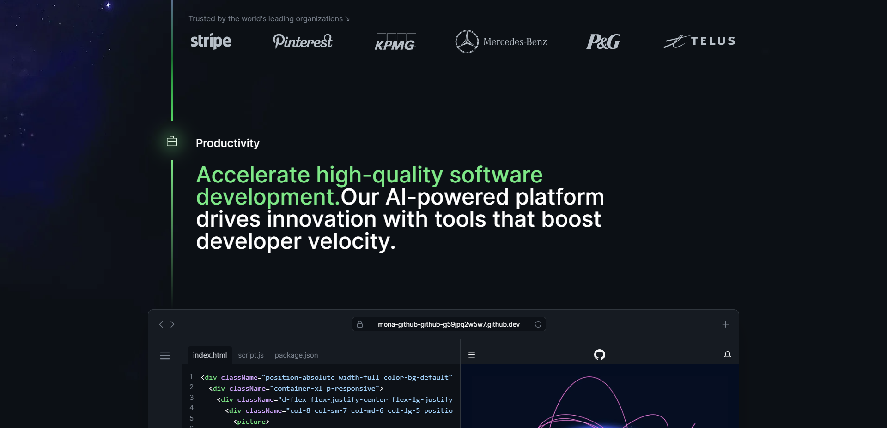
  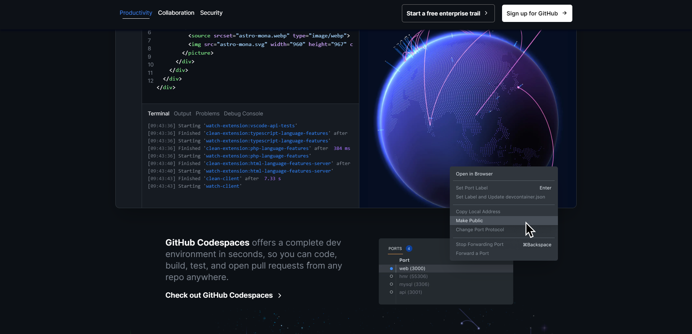
  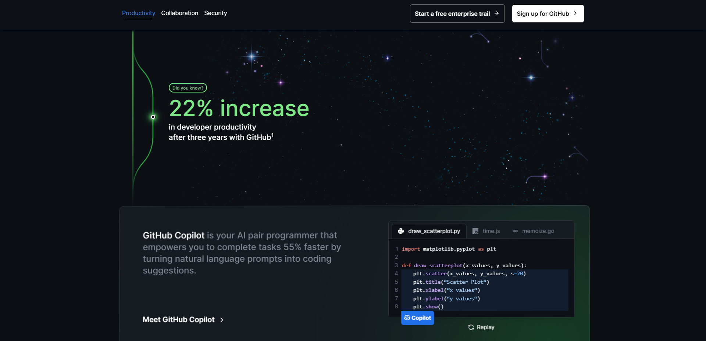
  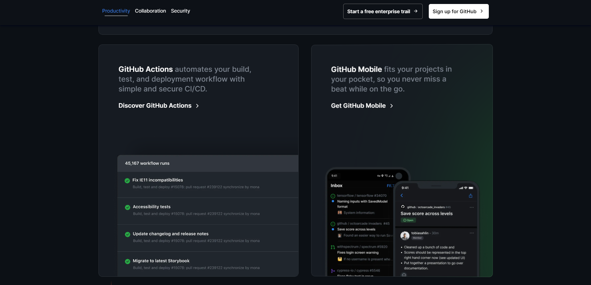
  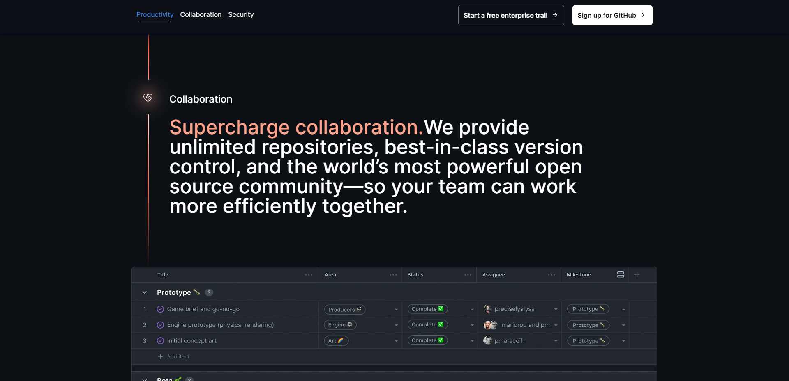
  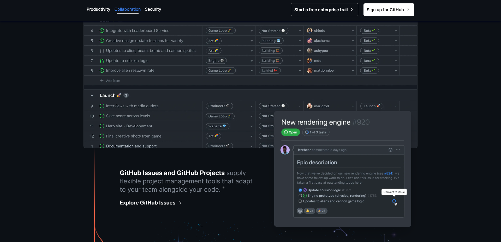
  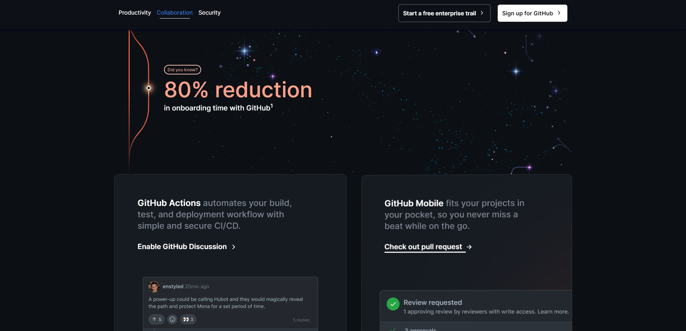
  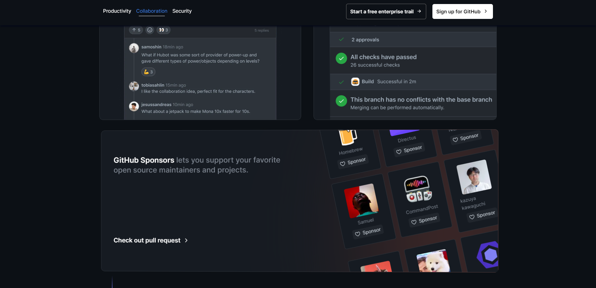
  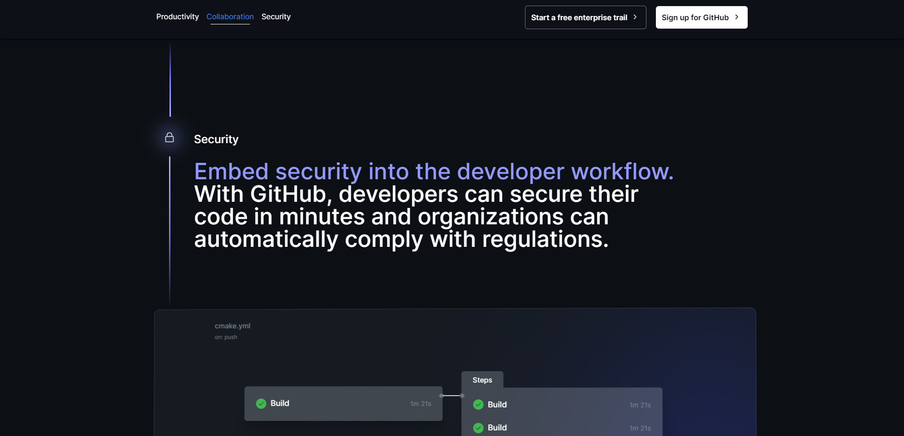
  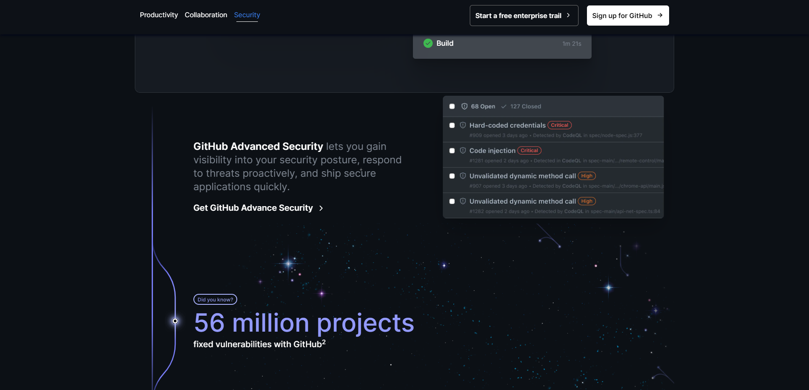
  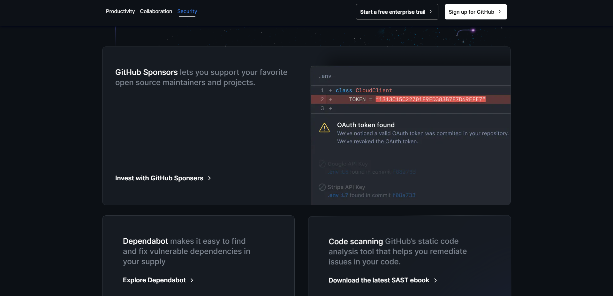
  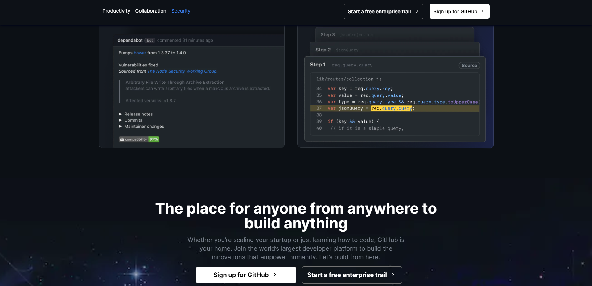
  
  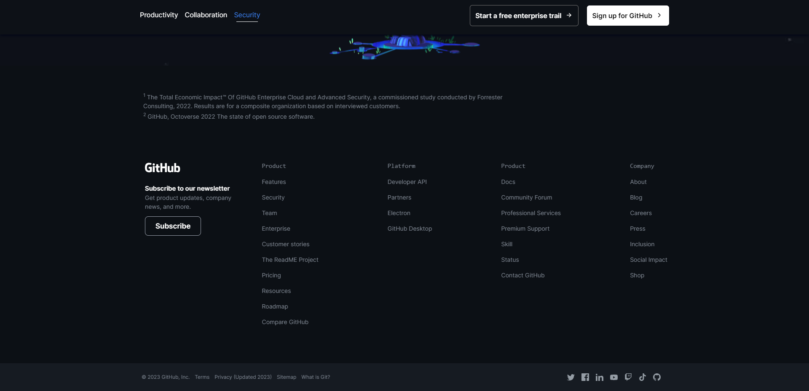
</div>

<p align="right">(<a href="#readme-top">back to top</a>)</p>

<!-- Contributing -->

## :wave: Contributing

<a href="https://github.com/ladunjexa/GitHub-Webpage/graphs/contributors">
  
</a>

Contributions are always welcome!

See [`contributing.md`](https://contributing.md/) for ways to get started.

Contributions are what make the open source community such an amazing place to learn, inspire, and create. Any contributions you make are **greatly appreciated**.

If you have a suggestion that would make this better, please fork the repo and create a pull request. You can also simply open an issue with the tag "enhancement".
Don't forget to give the project a star! Thanks again!

1. Fork the Project
2. Create your Feature Branch (`git checkout -b feature/AmazingFeature`)
3. Commit your Changes (`git commit -m 'Add some AmazingFeature'`)
4. Push to the Branch (`git push origin feature/AmazingFeature`)
5. Open a Pull Request

<p align="right">(<a href="#readme-top">back to top</a>)</p>

<!-- License -->

## :warning: License

Distributed under the MIT License. See [LICENSE.txt](https://github.com/ladunjexa/GitHub-Webpage/blob/main/LICENSE) for more information.

<p align="right">(<a href="#readme-top">back to top</a>)</p>

<!-- Contact -->

## :handshake: Contact

Liron Abutbul - [@lironabutbul6](https://twitter.com/lironabutbul6) - [@ladunjexa](https://t.me/ladunjexa)

Project Link: [https://github.com/ladunjexa/GitHub-Webpage](https://github.com/ladunjexa/GitHub-Webpage)

<p align="right">(<a href="#readme-top">back to top</a>)</p>

<!-- Acknowledgments -->

## :gem: Acknowledgements

This section used to mention useful resources and libraries that used in Flexibble Web project.

- [NextJS](https://nextjs.org/)
- [React](https://reactjs.org/)
- [TypeScript](https://www.typescriptlang.org/)
- [TailwindCSS](https://tailwindcss.com/)
- [UUID](https://www.npmjs.com/package/uuid)
- [Cobe](https://cobe.vercel.app/)
- [React Spring](https://www.react-spring.dev/)
- [Framer Motion](https://www.framer.com/motion/)

<p align="right">(<a href="#readme-top">back to top</a>)</p>
